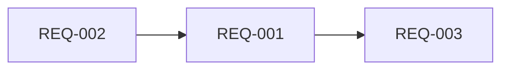

# Spec: Configurar nivel Test como escena jugable

<!-- METADATA
version: "4.0"
created: 2026-02-20
quality: ALTA
reqs: 3
has_context: true
adversarial_review: false
-->

## Objetivo

Hacer que la escena Test.tscn sea un nivel funcional que se pueda cargar y jugar desde MatchScene, siguiendo el patrón establecido por los niveles existentes.

## Contexto Técnico

| Aspecto | Detalle |
|---------|---------|
| Archivos principales | `levels/Test/Test.tscn`, `levels/Test/Test.tres` (crear), `match_scene/match_scene.tscn` |
| Patrón a seguir | `greenhill/greenhill.tscn`: root instancia .glb, asigna `level.gd`, referencia `.tres`, 4 `PlayerSpawnX` Node3D hijos |
| UIDs conocidos | level.gd: `uid://dpsy1u0t5ei1o`, stage_info.gd: `uid://bh7hc4po624b3`, .glb model: `uid://rhn1wxvhdt7p` |
| Riesgos | Ninguno |

### Referencia: greenhill.tscn (patrón canónico)

```ini
[gd_scene load_steps=4 format=3 uid="uid://csyxqjepcm26t"]

[ext_resource type="PackedScene" uid="..." path="res://levels/greenhill/greenhill.glb" id="1_lo584"]
[ext_resource type="Script" uid="uid://dpsy1u0t5ei1o" path="res://levels/level.gd" id="2_w524a"]
[ext_resource type="Resource" uid="..." path="res://levels/greenhill/greenhill.tres" id="3_x2y4a"]

[node name="greenhill" node_paths=PackedStringArray("player_spawn_1", "player_spawn_2", "player_spawn_3", "player_spawn_4", "camera_root_parent") instance=ExtResource("1_lo584")]
script = ExtResource("2_w524a")
stage_info = ExtResource("3_x2y4a")
player_spawn_1 = NodePath("PlayerSpawn1")
player_spawn_2 = NodePath("PlayerSpawn2")
player_spawn_3 = NodePath("PlayerSpawn3")
player_spawn_4 = NodePath("PlayerSpawn4")
camera_root_parent = NodePath(".")

[node name="PlayerSpawn1" type="Node3D" parent="." index="1"]
transform = Transform3D(1, 0, 0, 0, 1, 0, 0, 0, 1, -8.68931, 1.89115, -7.29632)
...
```

### Referencia: greenhill.tres (patrón canónico)

```ini
[gd_resource type="Resource" script_class="StageInfo" load_steps=2 format=3 uid="uid://bmxbk0ljq4rcw"]

[ext_resource type="Script" uid="uid://bh7hc4po624b3" path="res://levels/stage_info.gd" id="1_37uyw"]

[resource]
script = ExtResource("1_37uyw")
display_name = "Green Hill"
music_file_path = "uid://rr4qiitydhis"
metadata/_custom_type_script = "uid://bh7hc4po624b3"
```

## Requisitos

### REQ-001: Configurar Test.tscn como nivel jugable `MUST`

**Criterio de aceptación:**
- [ ] Root node instancia `Sprite Battle 3D Test Map idea.glb` (uid://rhn1wxvhdt7p)
- [ ] Root node tiene script `level.gd` (uid://dpsy1u0t5ei1o)
- [ ] Root node referencia `Test.tres` como stage_info
- [ ] 4 nodos `PlayerSpawn1`-`PlayerSpawn4` (Node3D) como hijos directos
- [ ] `player_spawn_1`-`player_spawn_4` apuntan a los spawns via NodePath
- [ ] `camera_root_parent = NodePath(".")`

### REQ-002: Crear StageInfo resource (Test.tres) `MUST`

**Criterio de aceptación:**
- [ ] Archivo `levels/Test/Test.tres` existe
- [ ] Usa script `stage_info.gd` (uid://bh7hc4po624b3)
- [ ] `display_name = "Test"`
- [ ] `music_file_path = ""` (sin música por ahora)

### REQ-003: Configurar MatchScene para cargar Test `MUST`

**Criterio de aceptación:**
- [ ] `test_stage` en `match_scene/match_scene.tscn` cambiado a `"Test"`
- [ ] Al ejecutar MatchScene, carga `res://levels/Test/Test.tscn`

## Dependencias



## Decisiones de Diseño

| Decisión | Justificación |
|----------|---------------|
| Posiciones de spawn genéricas (±5, 1, ±5) | Usuario ajustará en el editor visual de Godot |
| Sin música | Campo vacío permitido; no bloquea funcionalidad |
| Case-sensitive "Test" | Coincide con nombre de carpeta y archivo .tscn |

## Restricciones

- ❌ No modificar level.gd ni stage_info.gd
- ❌ No cambiar la estructura del MatchScene más allá de test_stage

## Post-Completion: Spawn Point Placement

Once all REQs are done, inform the user:

> **Next step: Fine-tune your spawn points in Godot.**
>
> 1. Open `levels/Test/Test.tscn` in the Godot editor
> 2. In the Scene tree, select `PlayerSpawn1`
> 3. Use the 3D gizmo (move tool, shortcut `W`) to drag it to where Player 1 should start
> 4. Repeat for `PlayerSpawn2`, `PlayerSpawn3`, `PlayerSpawn4`
> 5. Tip: spread them out evenly across the arena — typically pairs on opposite sides (1&2 near one end, 3&4 near the other)
> 6. Save the scene (`Ctrl+S`) — the transforms update automatically in the .tscn file

## Fuera de Alcance

- Ajuste fino de posiciones de spawn (se hace en editor)
- Asignación de música
- Agregar Test al stage_list permanente (solo test_stage)
